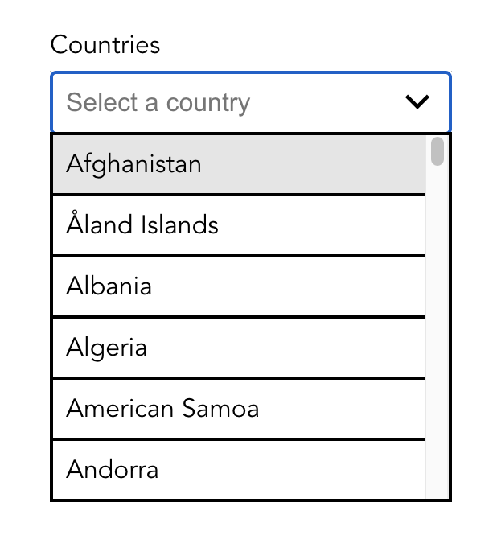

# Vue dropdown component

A Vue.js custom dropdown component with autocomplete functionality.



## Table of Contents

* [Usage](#usage)
* [Props](#props)
* [Methods](#methods)
* [Project setup](#project-setup)
  * [Security](#security)
  * [Compiles and hot-reloads for development](#compiles-and-hot-reloads-for-development)
  * [Compiles and minifies for production](#compiles-and-minifies-for-production)
  * [Run your unit tests](#run-your-unit-tests)
  * [Run your end-to-end tests](#run-your-end-to-end-tests)
  * [Lints and fixes files](#lints-and-fixes-files)
  * [Customize configuration](#customize-configuration)

## Usage

Example of usage:

```jsx
<BaseDropdown
  v-model="selection"
  label="countries"
  placeholder="Select a country"
  :options="options"
/>
```

## Props

Attribute | Description | Type | Default
------------ | ------------- | ------- | ---------
value | binding value, can be used with v-model | string, number, boolean | null
options | Array of available options. E.g [{ "label": "Strawberry", "code": "strawberry" }, | array | []
label | The value field's native label | string | null
placeholder | The placeholder text for the input field | string | null
disabled | Whether the field is disabled or not | boolean | false
name | Native name attritbute | string | null
filterable | Whether the options can be filtered by searching | boolean | true

## Methods

Method | Description | Params
------------ | ------------- | -------
focus | Programmatically focus on dropdown component | -
blur | Programmatically blur on dropdown component. It'll hide opened options list | -

## Project setup
```
npm install
```

### Compiles and hot-reloads for development
```
npm run serve
```

### Compiles and minifies for production
```
npm run build
```

### Run your unit tests
```
npm run test:unit
```

### Run your end-to-end tests
```
npm run test:e2e
```

### Lints and fixes files
```
npm run lint
```

### Customize configuration
See [Configuration Reference](https://cli.vuejs.org/config/).
